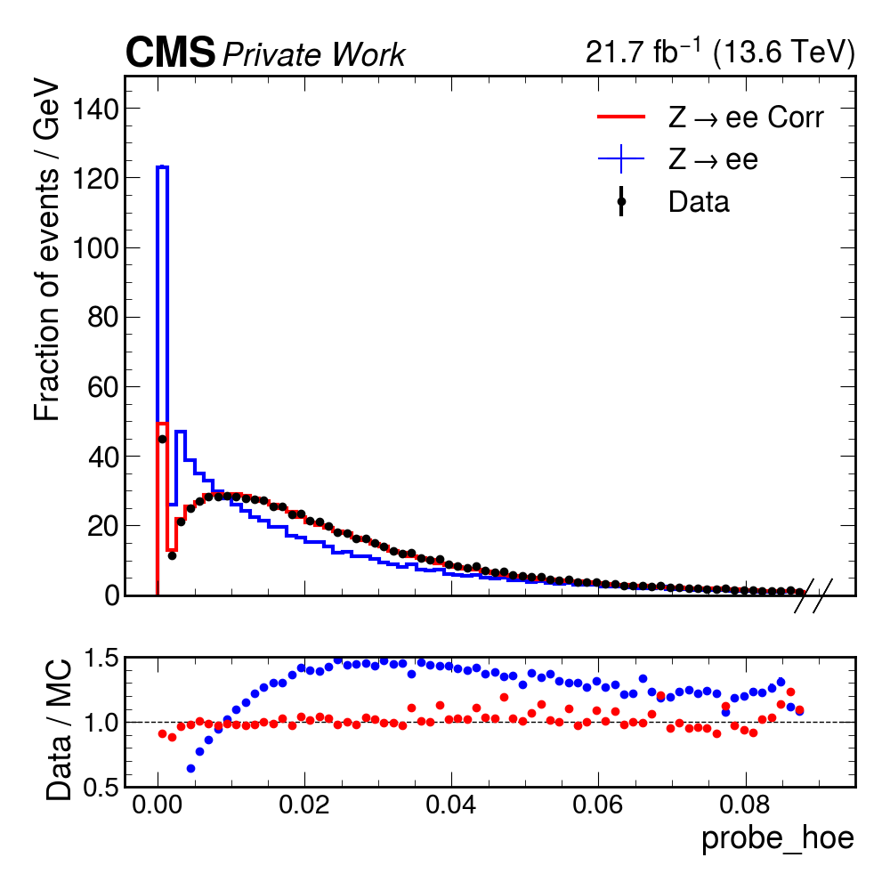
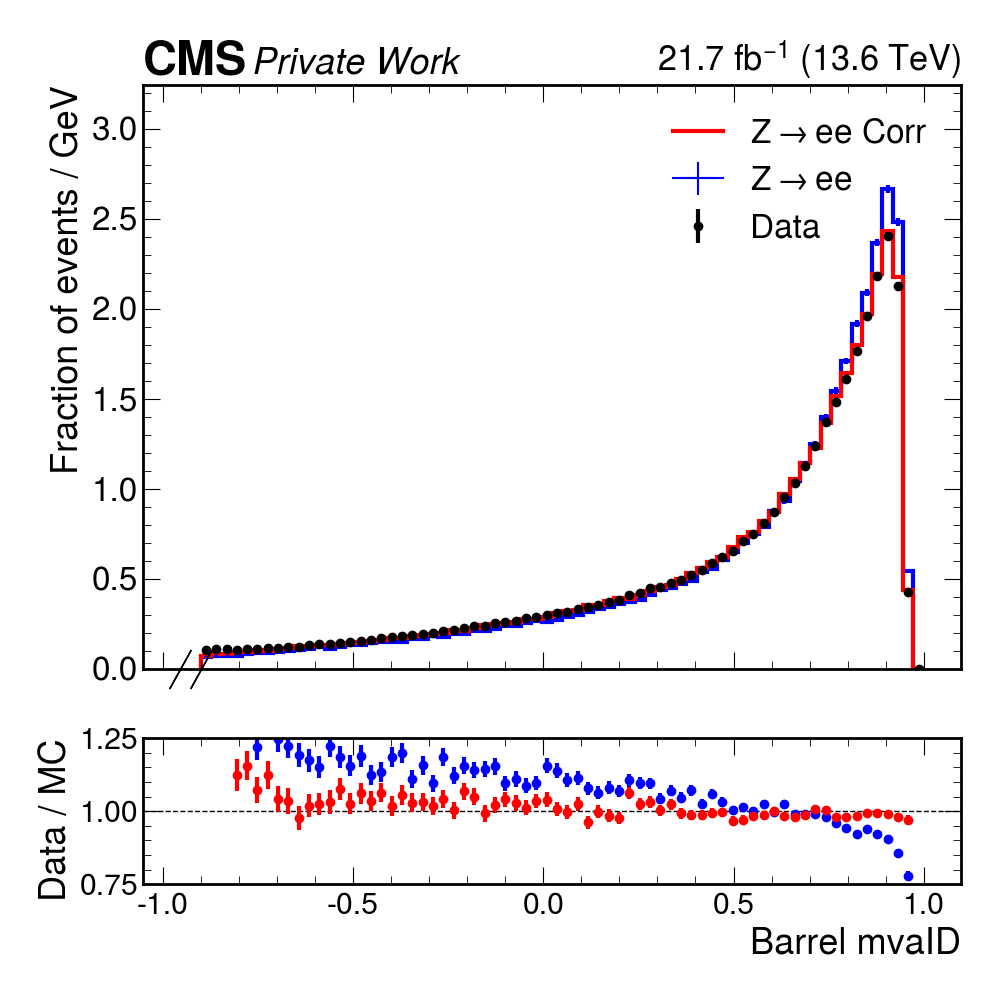

# Simulation corrections with Normalizing Flows

Repository dedicated to correcting simulation inaccuracies with neural spline auto-regressive flows. The code was developed using pytorch and the zuko normalizing flows library.

We utilize the monotonically increasing transformation characteristic of normalizing flows, ensuring that the quantiles in the target and latent spaces are preserved. This enables us to morph the quantiles of simulated and data distributions, thus performing the necessary corrections.

The main problem is that the diferences in simulation and data leads to diferent mva ID curves, where teh data has a more background like shape due to our incapability to include all possible detector effects into the simulation, which is used to train the mva ID. To correct that we need to include correction factors that may come with big uncertanties.

This project aims to use normalizing flows to correct the simulation distirbutions based on data distributions and with that achieve a better closure betwenn corrected simulation and data and decrese one of the major source of uncertanties in this analysis.

The images below shows preliminary results where the blue histogram is the nominal simulated distributions, the red are the corrected samples using normalizng flows and black dots are data.

HoverE is a example of distirbution not well modeled and that needs to be corrected. After correcting all variables used as input to the mvaID BDT, we can reevaluate it, and check that the flow corrected values achieve a better closure than the nominal simulation. Just to be clear, the corrections are performed all at once, since it is a multivariate distributions, with non trivial correlations between the variables.


<div style="display: flex; justify-content: space-between;">
  
  
</div>

## Usage

To run the tests one need to have the set the configurations of the flow in the flow_configuration.yaml and after run the main.py script.

The code is not fully finished, so one may need to set one or two paths.

## Condor submission

These files are set up to run at the RWTH Aachen condor infrastructure. The scripts specifically asks for a gpu machine in our cluster, but that can be easily changed in the flow.sub script.

```python
condor_submit flow.sub
```

Should take care of the condor submission! You can also easily specify the resources like memory, gpu and cpu in the flow.sub.

## Conda enviroment

To activate the conda enviroment one just needs to:

```python
conda activate flow_corrections
```

```python
conda env create -f environment.yml --name flow_corrections
```


